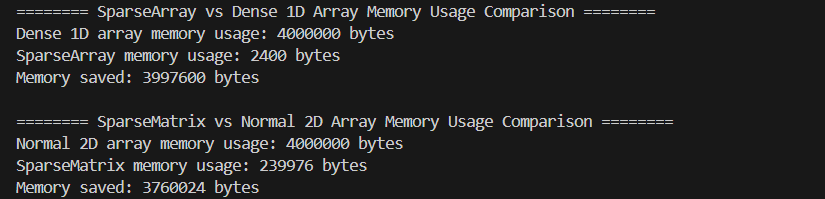

# Sparse-Array-and-Matrix
The DLL-based SparseArray and SparseMatrix optimize memory for sparse datasets by storing only non-zero elements in a doubly-linked list, significantly reducing storage compared to traditional arrays.


## Overview
This project provides two lightweight C++ libraries for handling sparse data efficiently:
- SparseArray: A one-dimensional array that only stores non-zero elements using a doubly linked list.
- SparseMatrix: A two-dimensional matrix implemented as a collection of SparseArray objects—each row is represented as a SparseArray—to reduce memory usage when the data is sparse.
## Features
- Memory Efficiency: Stores only non-zero values.
- Random Access: Supports element access and modification using get, set, and overloaded `operator[]`.
- Iterators: Provides a constant iterator to traverse non-zero elements.
- Robustness: Implements proper copy, assignment, and move semantics.
## Usage
1. Including the Libraries
Include the header files in your project:
```c++
#include "SparseArray.h"
#include "SparseMatrix.h"
```
2. Using SparseArray
Create a SparseArray, set non-zero values, and retrieve data:
```c++
/*--------------------------*/
int capacity = 1000;
SparseArray<int> sparseArray(capacity);

sparseArray[10] = 5;

int value = sparseArray[10];  

sparseArray[20] = 15;  

/*--------------------------*/
int rows = 100;
int cols = 100;
SparseMatrix<int> sparseMatrix(rows, cols);

sparseMatrix[5][5] = 42;

int matrixValue = sparseMatrix[5][5];

```